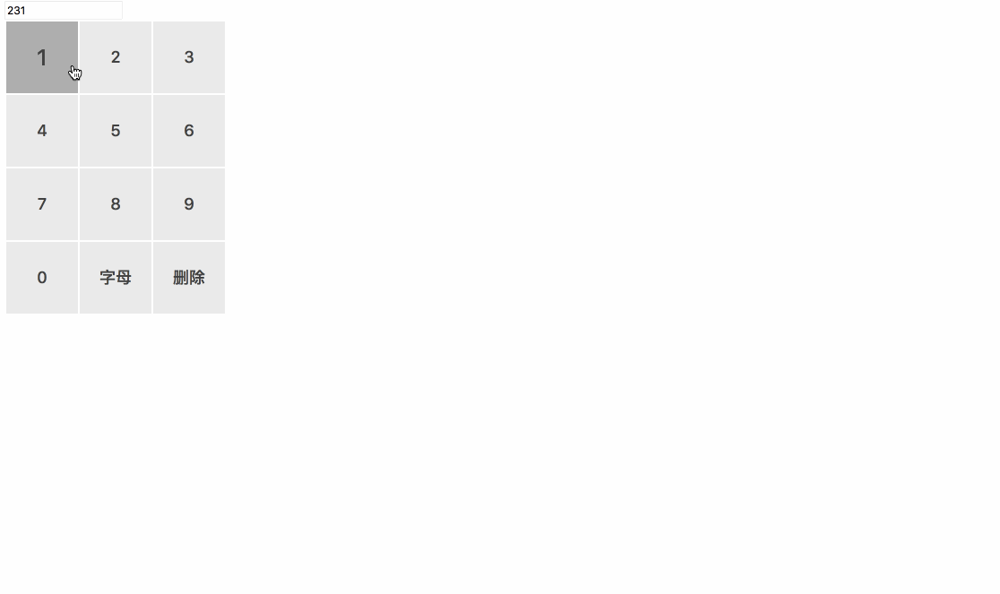

# KeyBorder
字母数字键盘

## 效果图

## 使用
  该插件是基于jquery或zepto的数字字母键盘
  
  $(document).ready(function() {
				var pageForm = {
					init:function(){
						$("#keybord-container").KeyBord($("#myInput"));
					}
				};
				pageForm.init();
});

options的参数 { 
				itemSize: "80px",// 每个键盘item的大小 
        digitalKeybordContainer: "digtal-keybord",// 
        charKeybordContainer: "char-keybord", 
				itemSpaceing: 2, 
				digitalKeybordColums: 3, 
				charKeybordColumns: 7, 
				isUpperCharKeybord: false, 
				isZepTo: false 
			}, 
